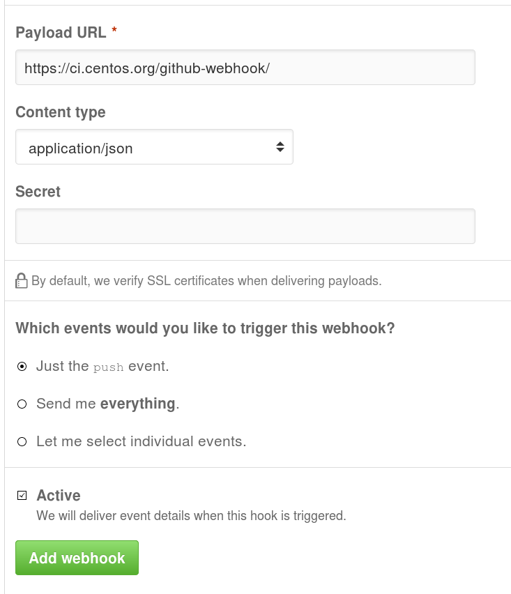
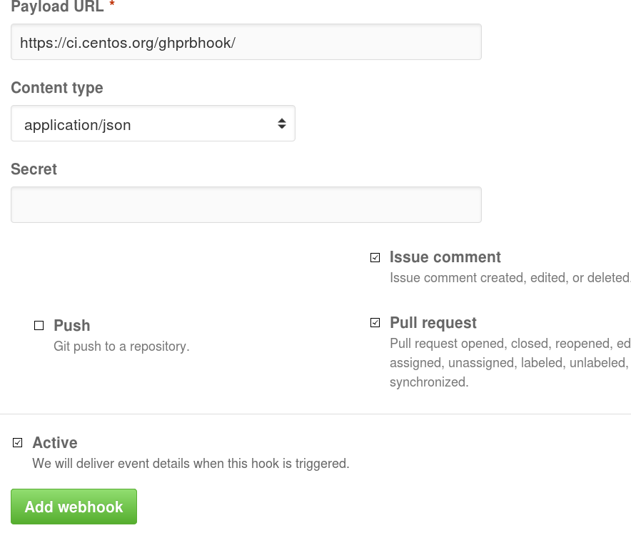
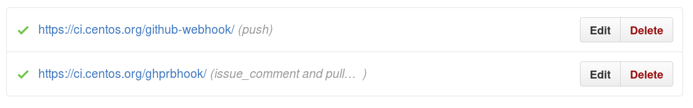

# Github project settings

This page describes the configuration needed to setup the communication between
[ci.centos.org](https://ci.centos.org) and github.

## WebHooks

For more details, see the [CentOS wiki](https://wiki.centos.org/QaWiki/CI/GithubIntegration).

1. Open the project settings

    

1. Select Webhooks

    

1. Click "Add a webhook" button

    

1. Create a push webhook to the url `https://ci.centos.org/github-webhook/`

    

1. Click "Add a webhook" button

    

1. Create a push webhook to the url `https://ci.centos.org/ghprbhook/`

    * select 'Let me select individual events'
    * unselect 'Push' and select 'Pull Request' and 'Issue Comment'

    

1. Check that the webhooks are correctly configured (green)

    

